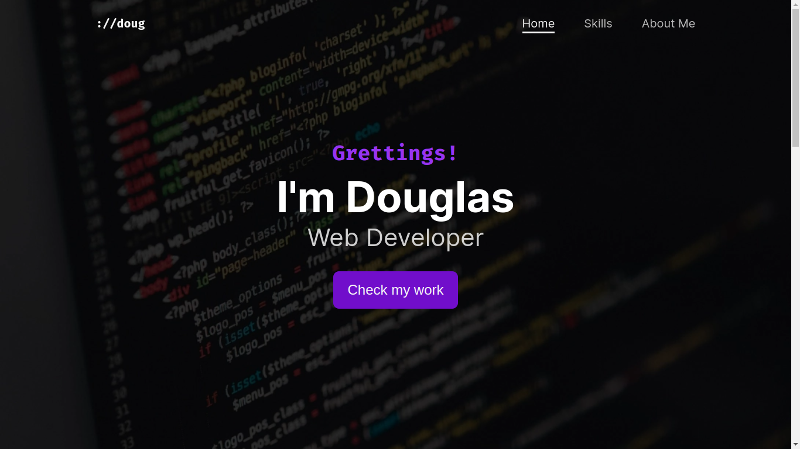
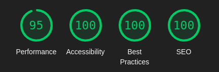

# **Vanilla Portfolio**

This is an old project of mine, built entirely with HTML, Sass and pure Javascript.

## Stack
- HTML
- CSS (using Sass preprocessor)
- Vanilla JavaScript

## Functionalities
- Responsive design that works on all screen sizes
- Dynamic header that changes when the page is scrolled
- Custom made scrollspy for navigation links

## About the project
On this project, I aimed to improve my design abilities without using any frameworks
like Bootstrap and jQuery.

I also focused on improving performance, accessibility and SEO, reaching a near perfect Lighthouse score.

**Lighthouse Score on desktop**

**Lighthouse Score on mobile**

